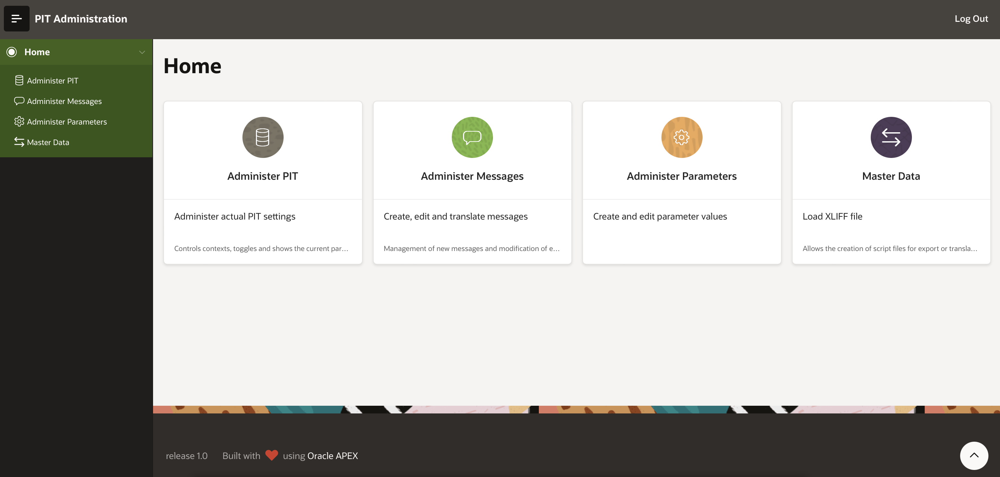
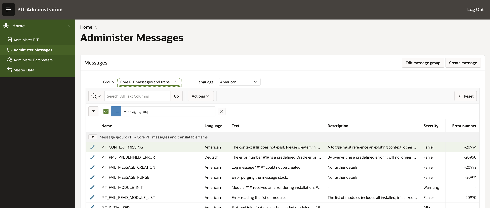
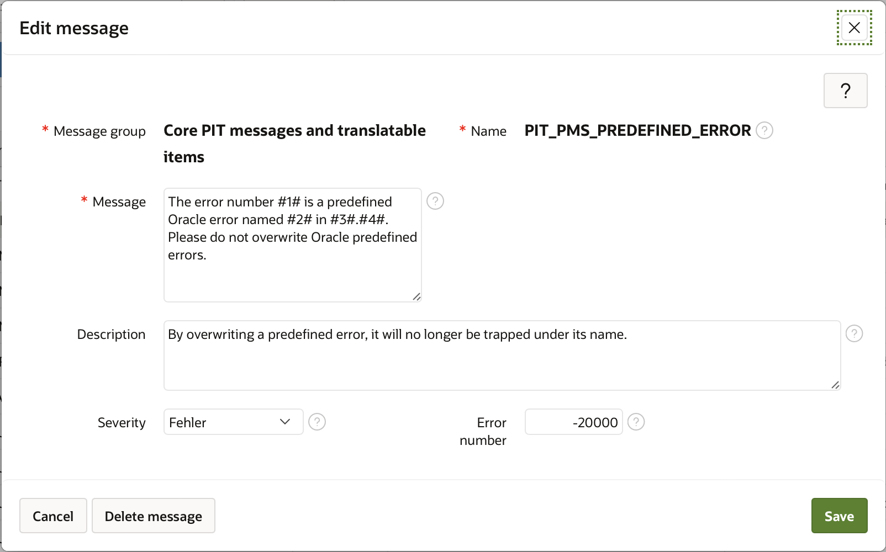
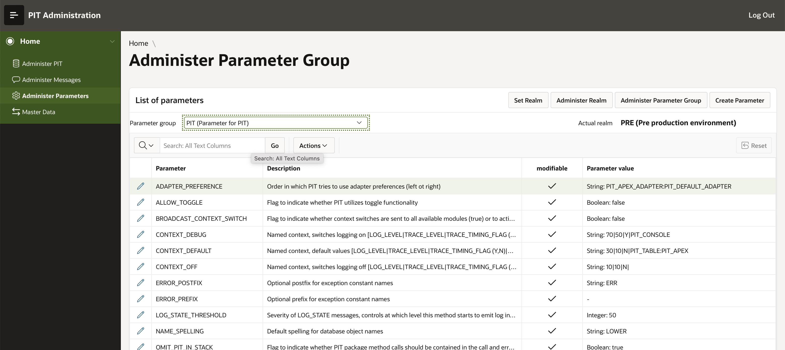
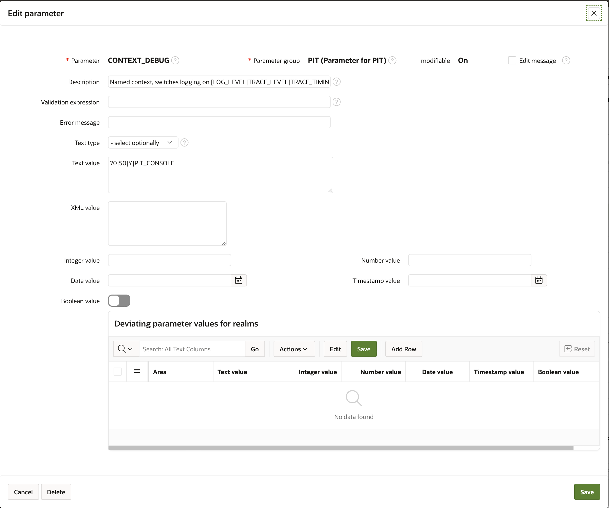
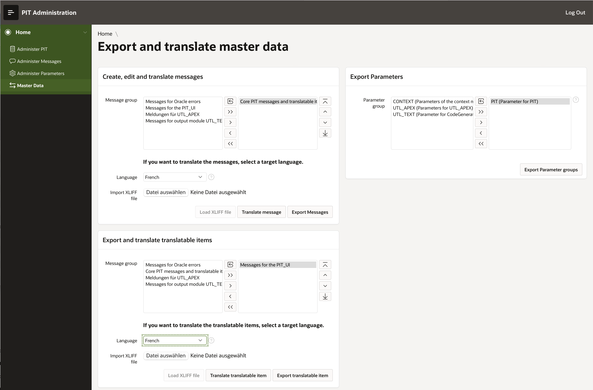

# Administrative APEX application

`PIT` ships with an APEX application that allows you to maintain parameters, messages and `PIT` administration by a GUI. It also allows to export any number of parameter or message groups as a zip file. These files contain script files in SQL that allow to deploy the parameters or messages to other environments.

`PIT` ships with APEX applications for various APEX versions. It starts with a version for APEX 5.1, continues with a version for APEX 19.1 and a new version for APEX 20.2. The latest version also includes a translation of the application to English, whereas the older applications are only available in German.

On the home screen of the application you can navigate to the respective application areas

## Administer PIT

The first application area controls the actually valid settings for `PIT`. In this area, you can adjust context settings, toggles and the like. The following screenshot shows the main screen of that area:

The »Installed output modules« report shows all `PIT` output modules installed on the system. It also shows whether they could be instantiated successfully and whether they are used for debugging right now. Clicking on the edit pencils allows you to adjust the output module parameters, such as fire threshold.

This is an editable grid, so you can directly adjust settings in the dialog and save it.

The »Available Contexts« section of the scrren shows the actually defined contexts and their debug and trace settings. By clicking on the edit pencil you can adjust the settings per context. You can also delete a context here. Keep in mind though that you can't delete the default context.

The »Filter Debugging by Package (Toggles)« section of the screen allows you to adjust toggle settings or create new toggles. It offers a list of available packages and a list of available contexts to choose from.

Finally, report »Current debug settings« shows the currently active settings for debug.

## Administer messages

The next application area allows to maintain and create messages. The following screenshot shows the main screen of that area:

The report shows all available messages and their translations, if available. You may filter the view by selecting a message group and/or a language. You can also search for a specific message by entering parts of the message name into the search field. 

By clicking on the edit pencil, a dialog to edit the selected message appears:

Note that the name and message group cannot be changed as they are technical keys.

By clicking on button »Edit Message Groups« it is possible to maintain the list of message groups. 

Once again, this is an editable grid that allows you to edit, create or delete the message groups. Remember though that you can't delete a message group that contains messages. You will have to first remove the messages (or use the PL/SQL method `PIT_ADMIN.delete_message_group` with the parameter `p_force`set to `TRUE`to remove all messages within that group in one go.

## Administer Parameter

The next application area allows to maintain parameters. The following screenshot shows the main screen of that area:

On this screen, you have to select a parameter group to display. The report then shows all parameters of that group, giving you the option to edit one parameter using the pencil link. Analogous to the administer messages screen, you can create new parameters, edit or delete existing parameters and maintain the parameter group list using the button »Administer Parameter Group«.

### Maintain Parameters

If you edit or create an existing parameter, a dialog box is shown that enables you to edit the details of a parameter:

This dialog is split into two areas. The upper area allows you to set the different aspects of a parameter. If the parameter is existing already, you can't change it's name or group, as those are technical keys. If the parameter group allows to edit the parameter values, this can be overriden on a per parameter basis. 

#### Validation expression and error message

You can provide the parameter with a PL/SQL snippet that checks the parameter value entered. If set, this code will be run against the parameter value. You can reference the string, integer, float or boolean values by utilizing text anchors (see the help text of item »Validation expression« for a list of available anchors). If this test fails, error message is raised, giving the end user an indication on the allowed values.

#### Parameter Realm

Despite the mandator awareness of parameters (they can be overwritten by a mandator without changing the default parameter value), it is sometimes useful to be able to maintain different parameter values per deployment target. This is referred to as a »realm«. Setting different parameter values per realm allows to maintain fi. a URL differently for development, test and prduction machines.

In the lower half of the dialog there is a editable grid, allowing you to select a realm and the respective value.

### Maintain parameter groups

To maintain the list of parameter groups, click on button »Eidt Parameter Groups«. An editable grid allows you to change settings of parameter groups or create new groups. Keep in mind though that you can't delete a parameter group if it is in use. Make sure to delete the parameters of this group first.

### Maintain Realms

Realms can be maintained in two different ways: First, by clicking on the button »Set Realm«, you can set the actually valid realm value for your environment. This will have an immediate effect on all parameter values, as the realm parameter overwrites will become active.

If you want to maintain the list of realms, click on button »Administer Realms« to open an editable grid and change the values there.

## Master Data

The last area of the APEX administration UI is dedicated to exporting and translating master data. The following screenshot shows the main screen of that area:

In the different areas you can do very similar things: 
- Select the groups of messages, parameters or translatable items you want to work with by moving them to the right hand side of the toggle controls
- Export the groups as zip files containing a file per selected group
- In the case of messages and translatable items, you can also select to create an XLIFF file for translation or to import an XLIFF file with the translated items

By importing a translated XLIFF file into the database, all messages or translatable items get translated immediately.

