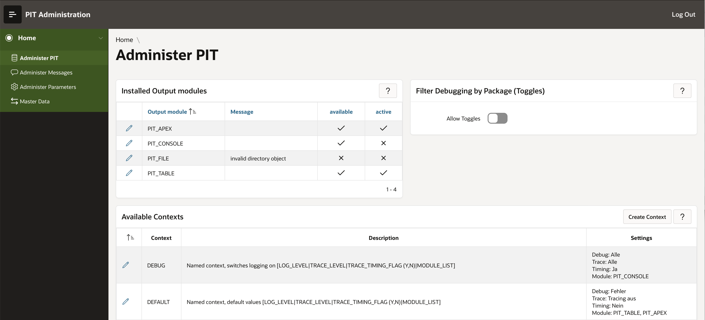
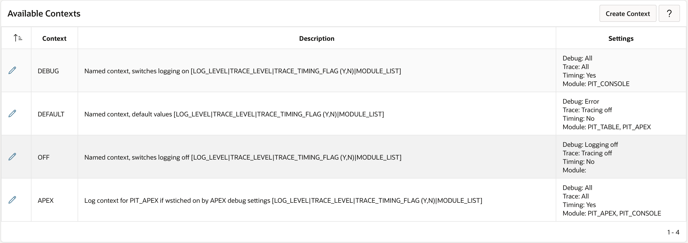

# Administrative APEX application

`PIT` ships with an APEX application that allows you to maintain parameters, messages and `PIT` administration by a GUI. It also allows to export any number of parameter or message groups as a zip file. These files contain script files in SQL that allow to deploy the parameters or messages to other environments.

## Overview of the application

`PIT` ships with APEX applications for various APEX versions. It starts with a version for APEX 5.1, continues with a version for APEX 18.1 and a new version for APEX 20.2. The latest version also includes a translation of the application to English, whereas the older applications are only available in German.

On the home screen of the application you can navigate to the respective application areas

### Administer PIT

The first application area controls the actually valid settings for `PIT`. In this area, you can adjust context settings, toggles and the like. The following screenshot shows the main screen of that area:

The »Installed output modules« report shows all `PIT` output modules installed on the system. It also shows whether they could be instantiated successfully and whether they are used for debugging right now. Clicking on the edit pencils allows you to adjust the output module parameters, such as fire threshold.

This is an editable grid, so you can directly adjust settings in the dialog and save it.

The »Available Contexts« section of the scrren shows the actually defined contexts and their debug and trace settings. By clicking on the edit pencil you can adjust the settings per context. You can also delete a context here. Keep in mind though that you can't delete the default context.

The »Filter Debugging by Package (Toggles)« section of the screen allows you to adjust toggle settings or create new toggles. It offers a list of available packages and a list of available contexts to choose from.

Finally, report »Current debug settings« shows the currently active settings for debug.

